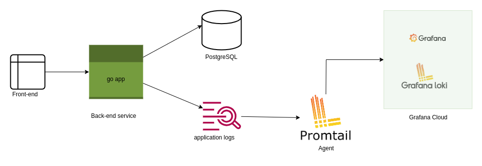

# go-url-shortener

---
# Software Architecture


---
# API list

### 1. /api/ping 
Request Method: GET

Response:
```json
{
    "status": "up and running"
}
```

### 2. /api/shorten
Request Method: POST

Request Body:
```json
{
  "url": "https://www.youtube.com/watch?v=TLB5MY9BBa4&ab_channel=CoderDave"
}
```
Response:
```json
{
    "results": {
        "id": 13,
        "actual_url": "https://www.youtube.com/watch?v=TLB5MY9BBa4&ab_channel=CoderDave",
        "short_url": "77cf66ac",
        "total_hit": 0,
        "created_at": "2023-07-23T14:37:53.241159Z"
    }
}
```

### 3. /api/decode/{shortUrl}
Request Method: GET
Response:
```json
{
    "results": {
        "id": 13,
        "actual_url": "https://www.youtube.com/watch?v=TLB5MY9BBa4&ab_channel=CoderDave",
        "short_url": "77cf66ac",
        "total_hit": 6,
        "created_at": "2023-07-23T14:37:53.241159Z"
    }
}
```

### 4. /api/urls?limit=10&offset=10
Request Method: GET
Query Parameter:
```text
limit = <<number>> // 10
offset = <<number>> // 1
```
Response:
```json
{
    "count": 15,
    "results": [
        {
            "id": 14,
            "actual_url": "https://www.example.com/",
            "short_url": "8797b6c7",
            "total_hit": 0,
            "created_at": "2023-07-23T17:16:09.239242Z"
        }
    ]
}
```


